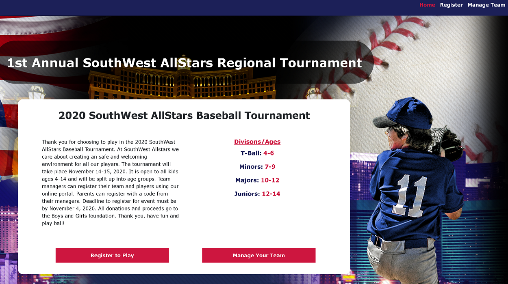
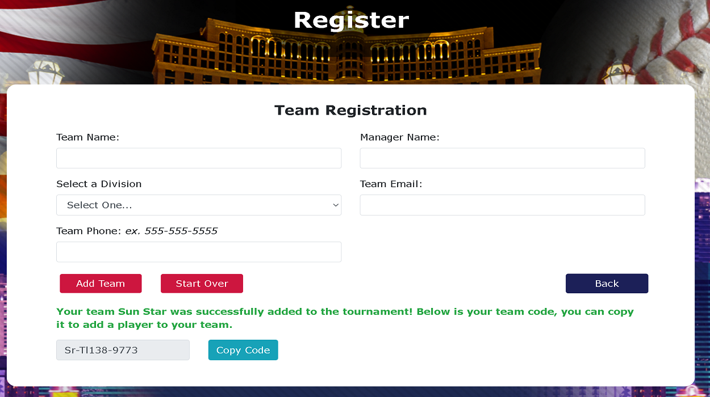
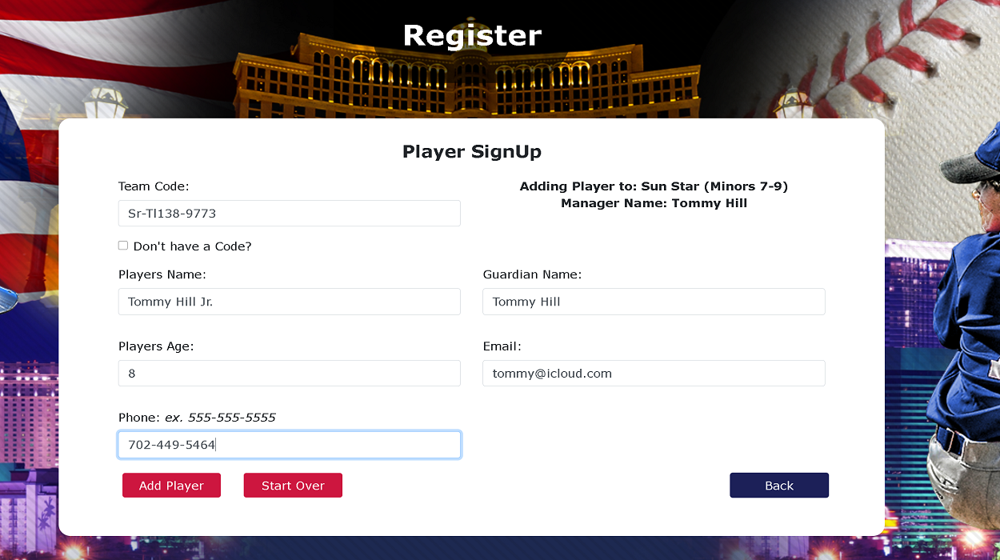
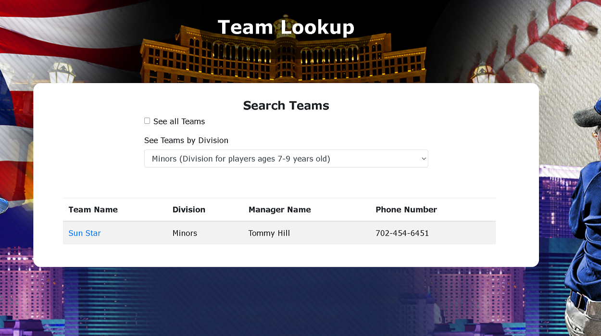
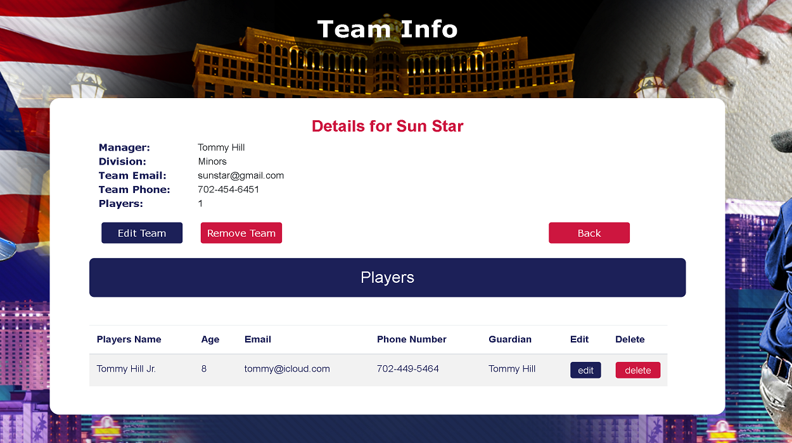
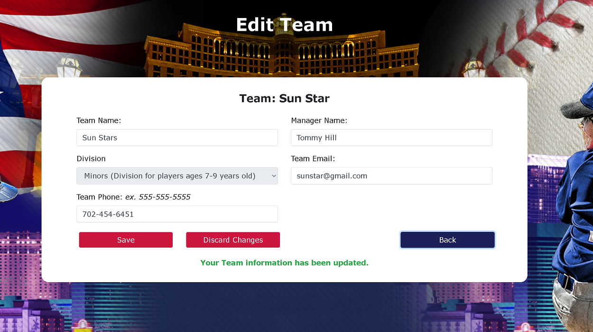
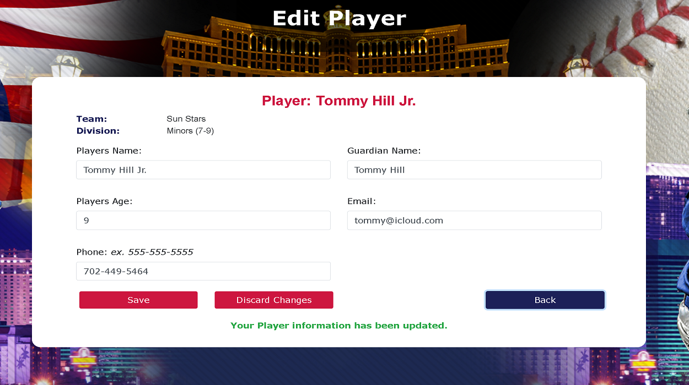
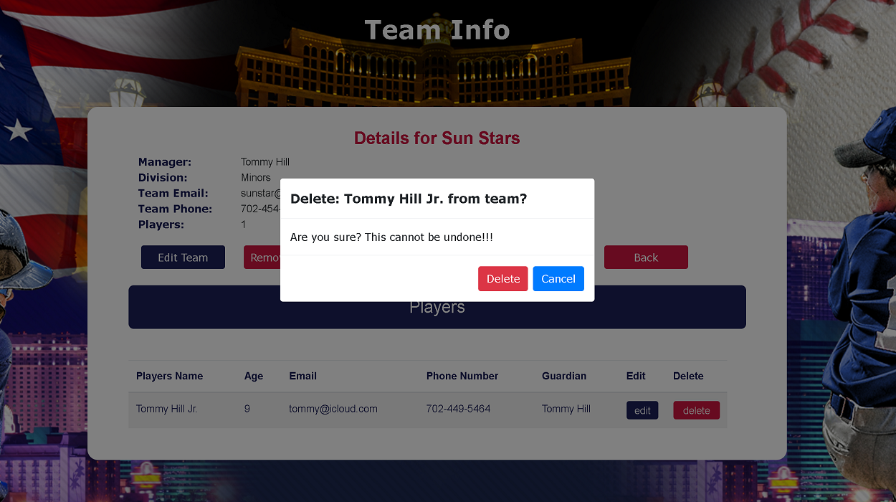
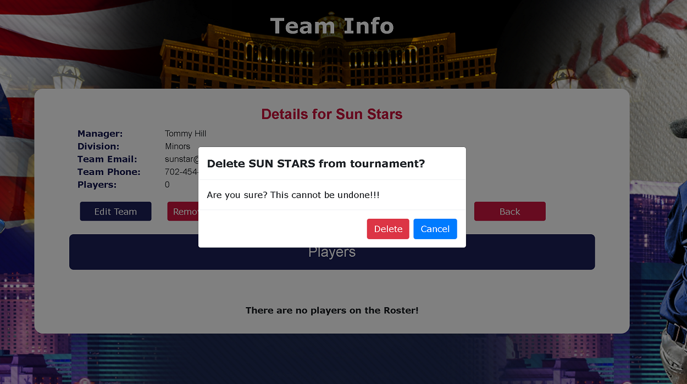
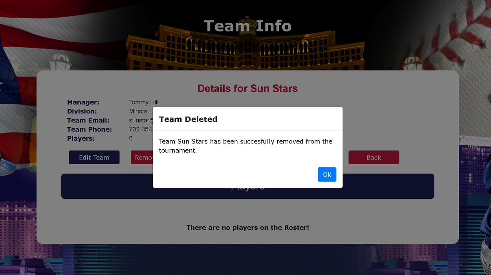

# SouthWest AllStars

## Release History

* 1.0.0
    * Initial Release: Website Deployed

This website allows participants of the 1st Annual 2020 SouthWest AllStars Baseball Tournament to register their teams and players to the event. Users can search the teams registered for the the event. From the roster page they can edit and delete players from team. Users can also remove players and the team from the event.

## Technologies Used to Create Website

* HTML
* CSS
* JavaScript
* Bootstrap 4
* jQuery
* Node.js
* Visual Studio Code
* Paint Shop
* GitHub
* Font Awesome
* Google Font
* Rest API

## Rest API Uses for site
* GET api/leagues - get method that pulls the divisions in the tournament from data/leagues.json file
* GET api/teams - get method that pull all teams in the tournament from data/teams.json file
* GET api/team/(id of team)/members/(id of player) - get method that gets a specific member from a specific team from data/teams.json
* POST api/team - post method that add team to tournament and writes to data/teams.json
* PUT api/ team - put method that edits a team and writes to data/teams.json
* POST api/team/(id of team)/members - post method that adds a player to a specific team and writes to data/teams.json
* PUT api/team/(id of team)/members- put method that edit a player and writes to data/teams.json
* DELETE /api/teams/(id of team/members/(id of player) - deletes a specific member on a specfic team, modifies data.teams.json
* DELETE /api/teams/(id of team) - deletes a team by their id, modifies data.teams.json

 
## Installation

GitHub:
https://github.thehartford.com/JD66126/sw_allstars.git

### To run SouthWest AllStars

* Open Visual Studio Code
* Open New Terminal
* In terminal find the command prompt
* Install the Express framework and body-parser using NPM via the terminal window
> npm install --save express body-parser
* Run the following command
> node server.js
* You will see a message in the command prompt that says it is listening on port 8081 −

* To Run Page open Chrome and enter the following in the address bar
http://localhost:8081/index.html

* To stop the server if terminal was close
> taskkill /F /IM node.exe

## Meta

Jesse Duenas–  jesse.duenas@thehartford.com
(https://github.thehartford.com/JD66126)

## Page Information

### Register Team

* This page allows a user to enter their team in the tournament
* The page give the user an access code which can be used later to add a player to the team
* The page allows the user to copy the code in memory

### Register Player

* Users can signup their player to the event
* The user can either use a code or a dropdown to find the team they wish play for
* The app searches the database to find the code entered and advises the customer to use the drop down list if the code is not found

### Search Teams

* The team lookup page gives the ability to the user to find a team by viewing all or by division
* The user can click on the name of team to bring up the roster of the team

### Team Roster

* The team info page allow the user to view the players on the team roster
* This page has edit and delete features for team and players

### Edit Team 

* This page allows editing of the team. The user however cannot change the division, a deletion of the team would be necessary to change divisions
* The form prevents data from being sent to the server if no changes are detected
* The form has a discard feature which will roll back changes if not saved

### Edit Player

* This page allows editing of the player
* The form also prevents data from being sent to the server if no changes are detected
* The form has a discard feature which will roll back changes if not saved

### Delete Player

* From this page the user can remove the player from the team by clicking delete button
* The user is warned their action is permanent

### Delete Team

* From this page the user can remove the team from the tournament by clicking delete button
* The user is warned their action is permanent

### Delete Team Confirmation

* The deletion of the team is confirmed by a modal

## Debugging and Testing

* js error and warnings -  No warnings or errors on console for all pages
* HTML errors - all files passed checker with no errors
* HTML warning - no warnings
* CSS errors - all files passed checker with no errors

* Tested website for functionality, website is responsive.

## Contributing

* FontAwesome
* Google Fonts
